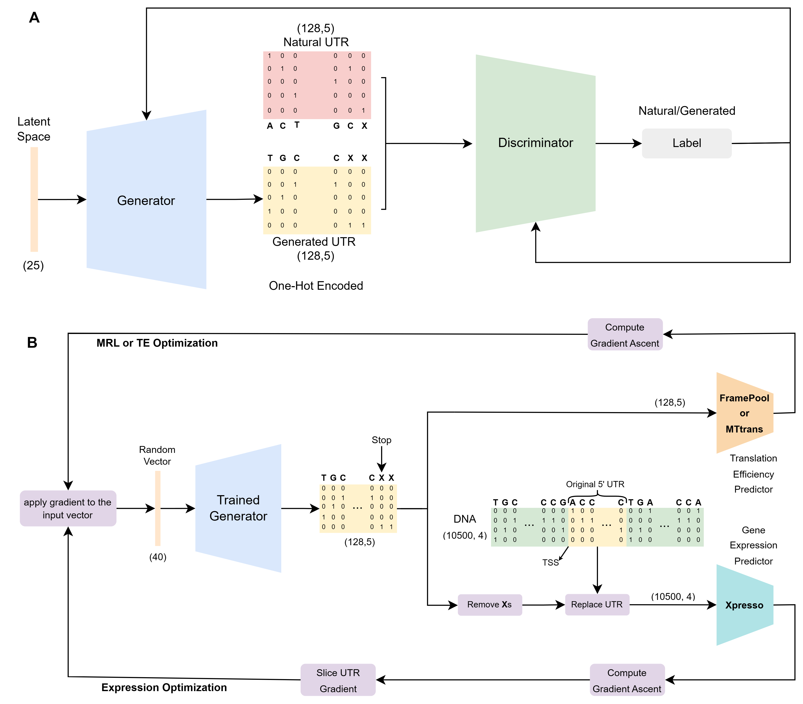

# UTRGAN


# UTRGAN: Learning to Generate 5' UTR Sequences for Optimized Translation Efficiency and Gene Expression


> UTRGAN is a is a deep learning based model for novel 5' UTR generation and optimziation. We use the WGAN-GP architecture for the generative model, and the Xpresso, FramePool, and MTtrans models for optimizing the TPM expression, Mean Ribosome Load (MRL), and Translation Efficiency (TE), respectively.

> <a href="https://en.wikipedia.org/wiki/Deep_learning" target="_blank">**Deep Learning**</a>,<a href="https://arxiv.org/pdf/1704.00028v3.pdf" target="_blank">**WGAN-GP**</a>, <a href="https://github.com/vagarwal87/Xpresso" target="_blank">**Xpresso**</a>, <a href="https://github.com/Karollus/5UTR" target="_blank">**FramePool**</a>.<a href="https://github.com/holab-hku/MTtrans" target="_blank">**MTtrans**</a>

> Diagram of the generative model (WGAN) and the optimization procedure

<p align="center">
<br>

---

## Authors

Sina Barazandeh, Furkan Ozden, Ahmet Hincer, Urartu Ozgur Safak Seker, A. Ercument Cicek

---

## Questions & comments 

[firstauthorname].[firstauthorsurname]@bilkent.edu.tr

[correspondingauthorsurname]@cs.bilkent.edu.tr

---


## Table of Contents 

> Warning: Please note that the UTRGAN model is completely free for academic usage. However it is licenced for commercial usage. Please first refer to the [License](#license) section for more info.

- [Installation](#installation)
- [Features](#features)
- [Instructions Manual](#instructions-manual)
- [Reproducing Results](#reproduce)
- [Usage Examples](#usage-examples)
- [Citations](#citations)
- [License](#license)


---

## Installation

- UTRGAN is easy to use and does not require installation. The scripts can be used if the requirements are installed.

### Requirements

For easy requirement handling, you can use utrgan.yml files to initialize conda environment with requirements installed:

```shell
$ conda env create --name utrgan -f utrgan.yml
$ conda activate utrgan
```

Note that the provided environment yml file is for Linux systems. For MacOS users, the corresponding versions of the packages might need to be changed.
---

## Features

- UTRGAN components are trained using GPUs and GPUs are used for the project. However, depending on the type of Tensorflow <a href="https://www.tensorflow.org/" target="_blank">**Tensorflow**</a> the model can run on both GPU and CPU. The run time on CPU is considerably longer compared to GPU.


## Instructions Manual
Important notice: Please call the wgan.py script from the ./src/gan directory. The optimization scripts for gene expression and MRL/TE are in the ./src/exp_optimization and ./src/mrl_te_optimization directories, respectively. To analyze the generated seqeunces use the ./src/analysis/violin_dists.py script.

### Train teh GAN modes:

```shell
$ python ./src/gan/wgan.py
```

#### Arguments

##### -gpu
- The gpus that will be set as "CUDA_VISIBLE_DEVICES", cpu will be used as default

##### -bs, --batch_size
- The batch size used to train the model, the default value is 64 

##### -d, --dataset
- The CSV file including the UTR samples. The default path used is './data/utrdb2.csv'.

##### -lr, --learning_rate
- The learning rate of the Adam optimizer used to optimize the model parameters. The default value is 1e-5. If 4 is provided, the learning rate will be 1e-4.

##### -mil, --min_length
- Minimum length of the UTRs used for training the model. Default: 64.

##### -mxl, --max_length
- Maximum length of the UTRs used for training the model. Default: 128.

##### -dim, --dimension
- The dimension of the input noise, with the default value of 40.

### Optimize a single gene for optimization:

```shell
$ python ./src/exp_optimization/single_gene.py
```

#### Arguments

##### -gpu
- The gpus that will be set as "CUDA_VISIBLE_DEVICES", cpu will be used as default

##### -g
- The name of the txt file including the gene dna
- The file should be: /src/exp_optimization/genes/GENE_NAME.txt

##### -lr
- The learning rate of the Adam optimizer used to optimize the model parameters. The default value is 3e-5. 

##### -s
- The number of iterations the optimization is performed. The default value is 3,000 iterations.

##### -gc
- The upper limit for the GC content (percentage(e.g. 65)). Default: No limit

##### -bc
- The number of 5' UTR sequences generated and optimized. Default: 128.

### Optimize multiple genes for optimization:

```shell
$ python ./src/exp_optimization/multiple_genes.py
```

#### Arguments

##### -gpu
- The gpus that will be set as "CUDA_VISIBLE_DEVICES", cpu will be used as default

##### -g
- The name of the txt file including the gene dna
- The file should be: /src/exp_optimization/genes/GENE_NAME.txt

##### -lr
- The learning rate of the Adam optimizer used to optimize the model parameters. The default value is 3e-5. 

##### -dc
- The number of Randomly selected genes. Default: 128.

##### -bs
- The number of 5' UTR optimized per DNA. Default: 128.

### Joint optimization of translation efficiency and gene expression:

```shell
$ python ./src/exp_optimization/joint_opt.py
```

#### Arguments

##### -gpu
- The gpus that will be set as "CUDA_VISIBLE_DEVICES", cpu will be used as default

##### -g
- The name of the txt file including the gene dna
- The file should be: /src/exp_optimization/genes/GENE_NAME.txt

##### -lr
- The learning rate of the Adam optimizer used to optimize the model parameters. The default value is 3e-5. 
- 
##### -bs
- The number of 5' UTR optimized per DNA. Default: 128.

### Optimize multiple UTRs for high MRL:

```shell
$ python ./src/mrl_te_optimization/optimize_variable_length.py
```

#### Arguments

##### -lr
- The learning rate of the Adam optimizer used to optimize the model parameters. The default value is 3e-5. 

##### -opt
- Either "te" or "mrl"

##### -bs
- The number of 5' UTR optimized. Default: 128.

## Reproduce

You should run the following scripts:

./src/mrl_te_optimization.py -task te

./src/mrl_te_optimization.py -task mrl

./src/exp_optimization/multiple_genes.py

./src/exp_optimization/single_gene.py -g [IFNG, TNF, TLR6, TP53]

./src/exp_optimization/joint_opt.py -g [IFNG, TNF, TLR6, TP53]

To reproduce plots:

./analysis/violin_plots.py

./analysis/plot_4x4.py

./analysis/opt_check.py

./analysis/mrl_te_opt.py

./src/exp_optimization/exp_joint.py

All the plots will be in: ./analysis/plots/

The p-values, confidence intervals and effect sizes will be printed in the terminal output of the "violin_plots.py" script

The average and maximum increase statistics will be printed for each boxplot generating script

## Usage Examples

> Usage of UTRGAN is very simple. You need to install conda to install the specific environment and run the scripts.

### Step-0: Install conda package management

- This project uses conda package management software to create virtual environment and facilitate reproducability.

- For Linux users:
 - Please take a look at the <a href="https://repo.anaconda.com/archive/" target="_blank">**Anaconda repo archive page**</a>, and select an appropriate version that you'd like to install.
 - Replace this `Anaconda3-version.num-Linux-x86_64.sh` with your choice

```shell
$ wget -c https://repo.continuum.io/archive/Anaconda3-vers.num-Linux-x86_64.sh
$ bash Anaconda3-version.num-Linux-x86_64.sh
```


### Step-1: Set Up your environment.

- It is important to set up the conda environment which includes the necessary dependencies.
- Please run the following lines to create and activate the environment:

```shell
$ conda env create --name utrgan -f utrgan.yml
$ conda activate utrgan
```

## Citations

---

## License


- **[CC BY-NC-SA 2.0](https://creativecommons.org/licenses/by-nc-sa/2.0/)**
- Copyright 2023 © UTRGAN.
- For commercial usage, please contact.