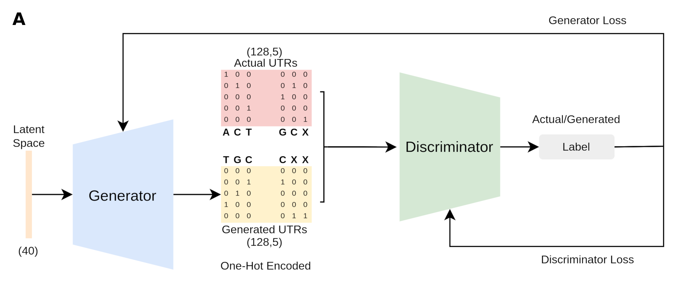
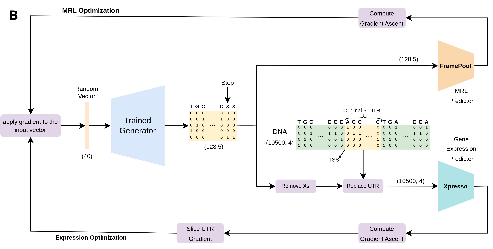

# UTRGAN


# Learning to Generate 5' UTR Sequences for Optimized Ribosome Load and Gene Expression


> UTRGAN is a is a deep learning based model for novel 5' UTR generation and optimziation. We use the WGAN-GP architecture for the generative model, and the Xpresso and FramePool models for optimizing the TPM expression and Mean Ribosome Load (MRL), respectively.

> <a href="https://en.wikipedia.org/wiki/Deep_learning" target="_blank">**Deep Learning**</a>,<a href="https://arxiv.org/pdf/1704.00028v3.pdf" target="_blank">**WGAN-GP**</a>, <a href="https://github.com/vagarwal87/Xpresso" target="_blank">**Xpresso**</a>, <a href="https://github.com/Karollus/5UTR" target="_blank">**FramePool**</a>

> Diagram of the generative model (WGAN)

<p align="center">
<br>

> Diagram of the optimization procedure for ribosome load and gene expression

<p align="center">
<br>

---

## Authors

Sina Barazandeh, Furkan Ozden, Ahmet Hincer, Urartu Ozgur Safak Seker, A. Ercument Cicek

---

## Questions & comments 

[firstauthorname].[firstauthorsurname]@bilkent.edu.tr

[correspondingauthorsurname]@cs.bilkent.edu.tr

---


## Table of Contents 

> Warning: Please note that the UTRGAN model is completely free for academic usage. However it is licenced for commercial usage. Please first refer to the [License](#license) section for more info.

- [Installation](#installation)
- [Features](#features)
- [Instructions Manual](#instructions-manual)
- [Usage Examples](#usage-examples)
- [Citations](#citations)
- [License](#license)


---

## Installation

- UTRGAN is easy to use and does not require installation. The scripts can be used if the requirements are installed.

### Requirements

For easy requirement handling, you can use utrgan.yml files to initialize conda environment with requirements installed:

```shell
$ conda env create --name utrgan_env -f UTRGAN_environment.yml
$ conda activate utrgan_env
```

Note that the provided environment yml file is for Linux systems. For MacOS users, the corresponding versions of the packages might need to be changed.
---

## Features

- UTRGAN components are trained using GPUs and GPUs are used for the project. However, depending on the type of Tensorflow <a href="https://www.tensorflow.org/" target="_blank">**Tensorflow**</a> the model can run on both GPU and CPU. The run time on CPU is considerably longer compared to GPU.


## Instructions Manual
Important notice: Please call the wgan.py script from the ./src/gan directory. The optimization scripts for gene expression and MRL are in the ./src/gene_optimization and ./src/mrl_optimization directories, respectively. To analyze the generated seqeunces use the ./src/analysis/analyze.py script.

### Train teh GAN modes:

```shell
$ python ./src/gan/wgan.py
```

#### Required Arguments

##### -bs, --batch_size
- The batch size used to train the model, the default value is 64 

##### -d, --dataset
- The CSV file including the UTR samples. The default path used is './data/utrs.csv'.

##### -lr, --learning_rate
- The learning rate of the Adam optimizer used to optimize the model parameters. The default value is 1e-5. If 4 is provided, the learning rate will be 1e-4.

##### -mil, --min_length
- Minimum length of the UTRs used for training the model. Default: 64.

##### -mxl, --max_length
- Maximum length of the UTRs used for training the model. Default: 128.

##### -dim, --dimension
- The dimension of the input noise, with the default value of 40.

#### Optional Arguments

##### -g, --gpu
- The ID of the GPU that will be used for training. The default setting is used otherwise.
- The same optional argument applies to the optimization and analysis scripts.

### Optimize a single gene for optimization:

```shell
$ python ./src/gene_optimization/single_gene.py
```

#### Required Arguments

##### -gp, --gene_path
- The path to a fasta file including the gene

##### -gn, --gene_name
- The name of the gene or the id of the gene in the fasta file

##### -lr, --learning_rate
- The learning rate of the Adam optimizer used to optimize the model parameters. The default value is 3e-5. 

##### -n, --n_iterations
- The number of iterations the optimization is performed. The default value is 3,000 iterations.

##### -uc, --utr_count
- The number of 5' UTR sequences generated and optimized. Default: 128.

### Optimize multiple genes for optimization:

```shell
$ python ./src/gene_optimization/multiple_genes.py
```

#### Required Arguments

##### -gp, --gene_path
- The path to a fasta file including the set of genes

##### -lr, --learning_rate
- The learning rate of the Adam optimizer used to optimize the model parameters. The default value is 3e-5. 

##### -dc, --dna_count
- The number of Randomly selected genes. Default: 128.

##### -uc, --utr_count
- The number of 5' UTR optimized per DNA. Default: 128.

### Optimize multiple UTRs for high MRL:

```shell
$ python ./src/mrl_optimization/optimize_variable_length.py
```

#### Required Arguments

##### -lr, --learning_rate
- The learning rate of the Adam optimizer used to optimize the model parameters. The default value is 3e-5. 

##### -uc, --utr_count
- The number of 5' UTR optimized. Default: 128.

## Usage Examples

> Usage of UTRGAN is very simple. You need to install conda to install the specific environment and run the scripts.

### Step-0: Install conda package management

- This project uses conda package management software to create virtual environment and facilitate reproducability.

- For Linux users:
 - Please take a look at the <a href="https://repo.anaconda.com/archive/" target="_blank">**Anaconda repo archive page**</a>, and select an appropriate version that you'd like to install.
 - Replace this `Anaconda3-version.num-Linux-x86_64.sh` with your choice

```shell
$ wget -c https://repo.continuum.io/archive/Anaconda3-vers.num-Linux-x86_64.sh
$ bash Anaconda3-version.num-Linux-x86_64.sh
```


### Step-1: Set Up your environment.

- It is important to set up the conda environment which includes the necessary dependencies.
- Please run the following lines to create and activate the environment:

```shell
$ conda env create --name utrgan_env -f UTRGAN_environment.yml
$ conda activate utrgan_env
```

## Citations

---

## License


- **[CC BY-NC-SA 2.0](https://creativecommons.org/licenses/by-nc-sa/2.0/)**
- Copyright 2023 © UTRGAN.
- For commercial usage, please contact.